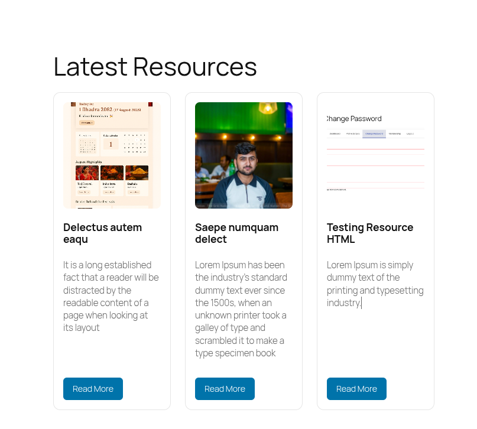

## Awesome Resource - CPT for WordPress

### How to use?

**USER GUIDE**
1. Find the latest release from [here](https://github.com/prunepal3339/awesome-resource/releases/download/v0.1.5/awesome-resource-v0.1.5.zip).
2. Go to `Your site > Upload Plugin` and upload the zip downloaded from above link.
3. Activate the plugin.
4. Notice a new menu is added called `Awesome Resources`.
5. Add few `Resources` with `title`, `excerpt` and `featured image`.
5. Use shortcode `[latest_resources limit="5"]` in any page.

**DEVELOPER GUIDE**

Note: To build the plugin, you must have following tools installed:

`PHP`, `Composer`, `Node.js` and `pnpm`.

1. Go to plugins directory.
2. Clone the repository.
3. Run `composer install`
4. Run `pnpm run build`
5. Repeat the **User Guide** from step 3.

### Demo
